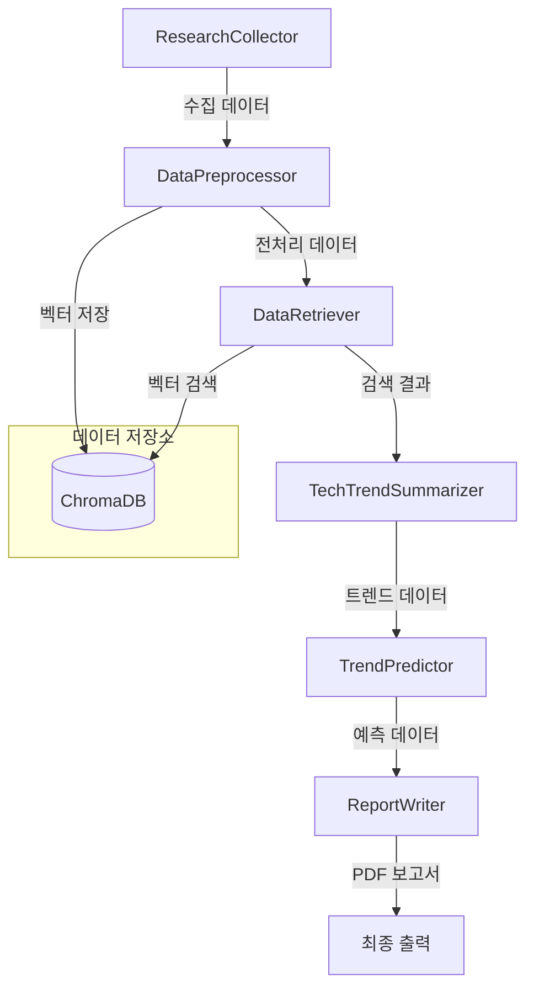

# UAM 기술 트렌드 분석 시스템

본 프로젝트는 UAM(Urban Air Mobility) 기술 트렌드 분석 에이전트를 설계하고 구현한 실습 프로젝트입니다.

## Overview

- **Objective**: UAM 기술 트렌드와 시장 동향을 분석하여 미래 발전 방향을 예측하고, 이를 바탕으로 종합적인 분석 보고서를 생성
- **Methods**: 
  - 데이터 수집: SerpAPI와 Tavily API를 활용한 UAM 관련 정보 수집
  - 데이터 전처리: 텍스트 정제, 키워드 추출, 벡터 데이터베이스 저장
  - 트렌드 분석: 수집된 데이터를 기반으로 핵심 트렌드 도출
  - 예측 생성: GPT-4를 활용한 기술 발전 예측
  - 보고서 작성: 분석 결과의 체계적 정리 및 PDF 생성
- **Tools**: 
  - OpenAI API: GPT-4-turbo-preview 모델 활용
  - ChromaDB: 벡터 데이터베이스
  - WeasyPrint: PDF 보고서 생성
  - Sentence Transformers: 다국어 텍스트 임베딩

## Features

- **다양한 소스 데이터 수집**: 뉴스 기사, 학술 논문, 시장 보고서 등 다양한 소스에서 UAM 관련 정보 수집
- **자동화된 데이터 전처리**: 텍스트 정제, 키워드 추출, 의미 있는 청크로 분할
- **실시간 트렌드 분석**: 수집된 데이터를 기반으로 핵심 트렌드 도출 및 중요도 평가
- **미래 예측 생성**: 현재 트렌드를 기반으로 향후 5년간의 기술 발전 방향과 시장 영향을 예측
- **자동화된 보고서 생성**: 분석 결과를 바탕으로 전문적인 PDF 형식의 보고서 자동 생성
- **다중 에이전트 협업**: 데이터 수집, 전처리, 분석, 예측, 보고서 작성 에이전트의 협업을 통한 효율적인 분석 프로세스
- **한국어 최적화**: 모든 분석 결과와 보고서가 한국어로 생성되며, 국내 UAM 시장에 특화된 인사이트 제공

## Tech Stack 

| Category   | Details                      |
|------------|------------------------------|
| Framework  | Python 3.8+                  |
| LLM        | GPT-4-turbo-preview via OpenAI API |
| Retrieval  | ChromaDB (벡터 데이터베이스)    |
| Database   | N/A (상태 객체 내 관리)         |
| PDF        | WeasyPrint (보고서 생성)     |
| Utils      | PyYAML, python-dotenv, logging |
| Search     | SerpAPI, Tavily API (데이터 수집) |
| Embedding  | Sentence Transformers (다국어 텍스트 임베딩) |

## Agents
 
- **ResearchCollector**: SerpAPI와 Tavily API를 사용하여 UAM 관련 정보 수집
- **DataPreprocessor**: 수집된 데이터의 텍스트 정제, 키워드 추출, 벡터 데이터베이스 저장
- **DataRetriever**: 벡터 데이터베이스에서 관련 정보 검색
- **TechTrendSummarizer**: 수집된 데이터를 기반으로 핵심 트렌드 도출
- **TrendPredictor**: 현재 트렌드를 기반으로 미래 기술 발전 방향 예측
- **ReportWriter**: 분석 결과를 종합하여 전문적인 보고서 생성

## State 

- **research_data**: 수집된 원본 연구 데이터
- **retrieved_data**: 검색된 관련 데이터
- **trends**: 현재 도출된 UAM 기술 트렌드 목록 (이름, 설명, 중요도, 증거 포함)
- **predictions**: 생성된 미래 예측 목록 (예측 내용, 시기, 신뢰도, 시장 영향 포함)
- **report**: 생성된 최종 보고서 내용
- **report_path**: 저장된 PDF 보고서 파일 경로
- **errors**: 처리 중 발생한 오류 목록

## Architecture



## Directory Structure
```
├── agents/                # 에이전트 모듈
│   ├── research_collector.py    # 데이터 수집 에이전트
│   ├── data_preprocessor.py     # 데이터 전처리 에이전트
│   ├── data_retriever.py        # 데이터 검색 에이전트
│   ├── tech_trend_summarizer.py # 트렌드 분석 에이전트
│   ├── trend_prediction.py      # 예측 생성 에이전트
│   └── report_writer.py         # 보고서 작성 에이전트
├── config/                # 설정 파일
│   ├── agent_config.yaml  # 에이전트 설정
│   └── agent_prompts.yaml # 프롬프트 템플릿
├── data/                  # 데이터 저장
│   ├── news/             # 뉴스 데이터
│   └── vectordb/         # 벡터 데이터베이스
├── outputs/              # 출력 파일
│   ├── reports/          # 생성된 보고서
│   └── logs/             # 로그 파일
├── tools/                # 유틸리티 도구
│   ├── vector_store.py   # 벡터 데이터베이스 관리
│   └── hybrid_retriever.py # 하이브리드 검색 구현
├── util/                 # 유틸리티 모듈
│   ├── agent_state.py    # 에이전트 상태 관리
│   └── config.py         # 설정 관리
├── workflows/            # 워크플로우 정의
│   └── agentic_rag_graph.py # 에이전트 워크플로우
├── main.py              # 메인 실행 스크립트
├── requirements.txt      # 의존성 패키지
└── README.md            # 프로젝트 문서
```

## 설치 및 실행

1. 의존성 설치:
```bash
# macOS 필수 의존성 설치
brew install pango cairo gdk-pixbuf

# Python 패키지 설치
pip install -r requirements.txt
```

2. 환경 변수 설정:
```bash
cp .env.example .env
# .env 파일에 다음 API 키 설정
# OPENAI_API_KEY=your_openai_api_key
# TAVILY_API_KEY=your_tavily_api_key
# SERPAPI_API_KEY=your_serpapi_api_key
```

3. 실행:
```bash
python main.py
```

## 라이선스

MIT License

## 기여

프로젝트에 기여하고 싶으시다면 Pull Request를 보내주세요. 모든 기여를 환영합니다.